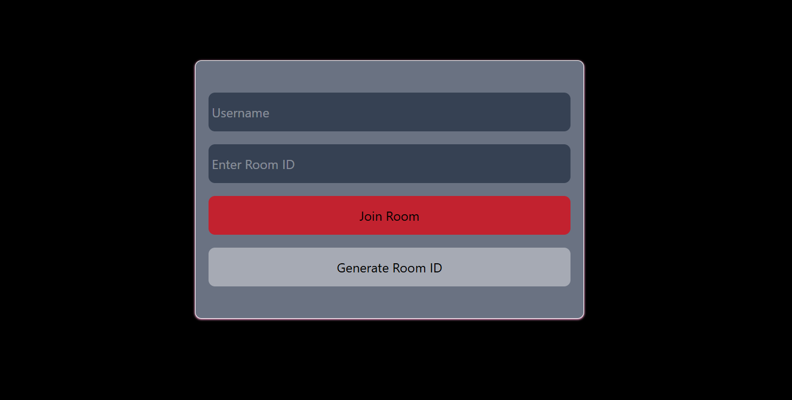
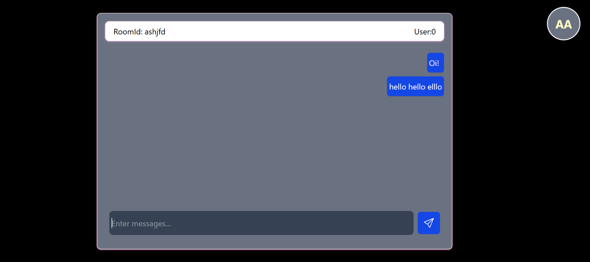

# Dummy Chat Application 




## Message Format Reference

### Join Message

**Sent by:** Frontend 
**Received by:** Backend

```javascript
{
  type: "join",
  payload: {
    username: "John",
    roomId: "123456"
  }
}
```

**Backend Response:**

```javascript
{
  type: "join",
  noOfUserInRoom: 2
}
```

---

### Chat Message

**Sent by:** Frontend
**Received by:** Backend → Other users

```javascript
{
  type: "chat",
  payload: {
    username: "John",
    roomId: "123456",
    message: "Hello everyone!"
  }
}
```

---


## Server Storage (How Backend Tracks Users) (In Memory)


```javascript
// Map to store all rooms and users
let allSockets = new Map<string, User[]>();

// User object
interface User {
  socket: WebSocket,      // Connection to send messages
  username: string        // User's name
}

// Example structure after 2 users join room "123456":
allSockets = {
  "123456": [
    { socket: WebSocket1, username: "John" },
    { socket: WebSocket2, username: "Jane" }
  ]
}
```

---


## ⚠️ Important Points

1. **WebSocket URL must match backend port**

   ```javascript
   // Frontend
   const ws = new WebSocket("http://localhost:8080");

   // Backend
   const wss = new WebSocketServer({ port: 8080 });
   ```

2. **Always stringify JSON before sending**

   ```javascript
   const message = JSON.stringify(obj);
   socket?.send(message);
   ```

3. **Always parse JSON when receiving**

   ```javascript
   ws.onmessage = (event) => {
     const parsed = JSON.parse(event.data);
   };
   ```

4. **Backend doesn't send message back to sender**

   ```javascript
   if (data.socket != socket) {
     // Skip sender
     data.socket.send(JSON.stringify(parsed));
   }
   ```

5. **Cleanup WebSocket when component unmounts**
   ```javascript
   return () => {
     ws.close();
   };
   ```

---

## 🚀 Quick Start

1. **Start Backend**

   ```bash
   cd backend
   pnpm run dev
   ```

2. **Start Frontend**

   ```bash
   cd frontend
   pnpm run dev
   ```

3. **Open in Browser**

   ```
   http://localhost:5173
   ```

4. **Test with Multiple Tabs**
   - Open same URL in 2 browser tabs
   - Join same room in both tabs
   - Send messages and see them appear


